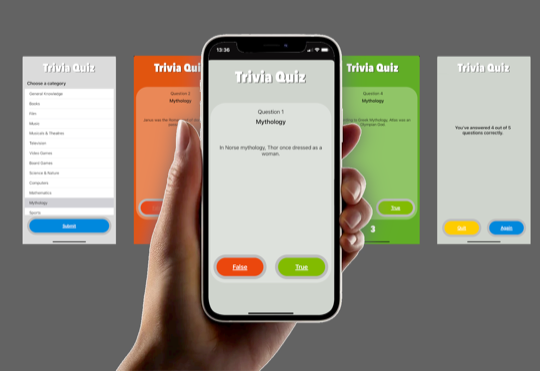

# Trivia Quiz

Test your knowledge with a fun and quick Trivia Quiz! Answer 5 true-or-false questions across various categories.
This app uses the [Open Trivia Database API]( https://opentdb.com/api.php)

## How to Play

- Choose from multiple trivia categories.
- Answer 5 true-or-false questions per round.
- Option to quit or select another category after completing a round.

Note: Some Open Trivia Database categories may not have 5 or more true-or-false questions available.

## Getting Started

- Fork and download the repository.
- Copy the files to your Pythonista app.
- Run main.py to start playing.
- (Optional) Use Apple's Shortcuts app for faster access.
